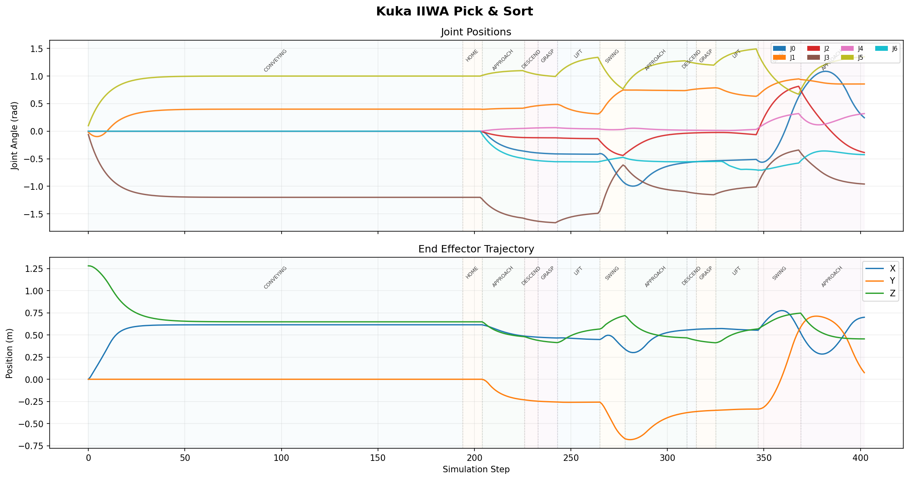
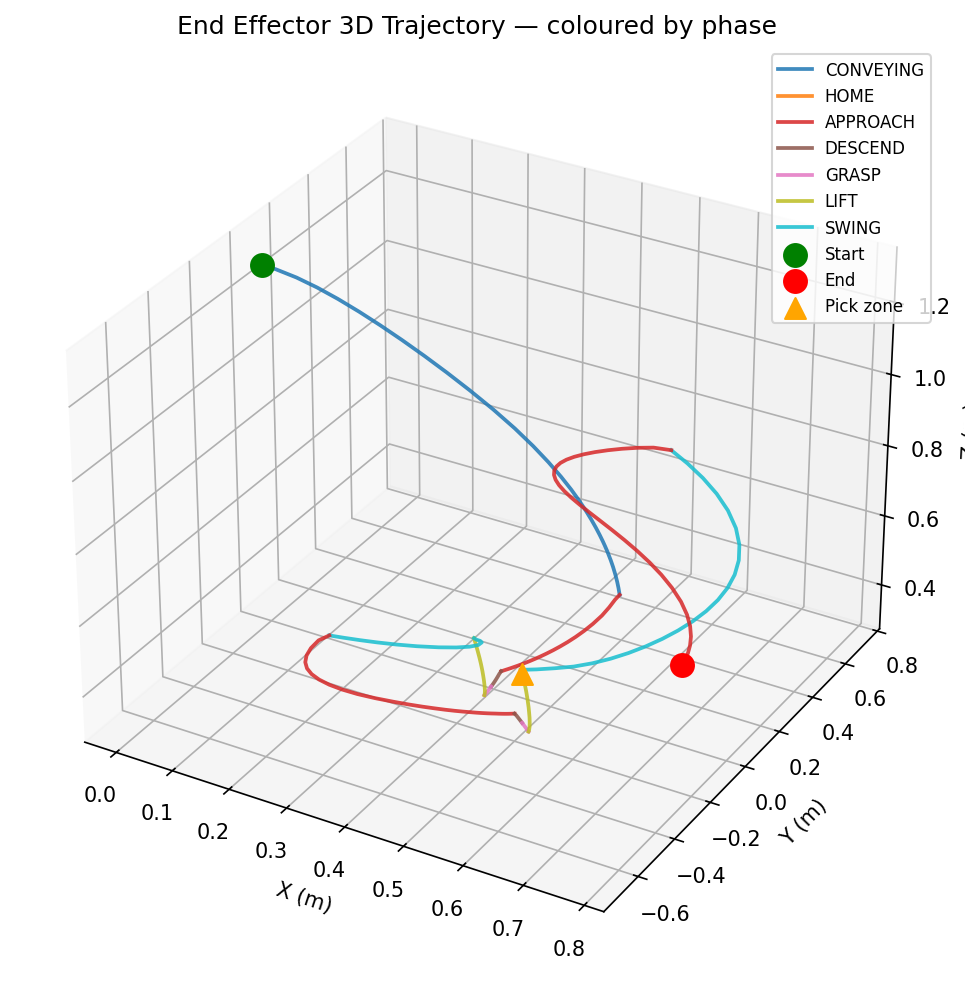

# Kuka IIWA Pick & Sort Simulation

A real-time 3D simulation of a **7-DOF Kuka IIWA robot arm** sorting objects from a conveyor belt into bins using inverse kinematics and ballistic tossing. Built with PyBullet.

---

## What it does

Objects of different shapes (cubes, cylinders, spheres) spawn randomly on a moving conveyor belt. When objects reach the pick zone the belt stops, the arm picks each one, lifts it, swings toward the correct bin, and **tosses** it in mid-swing using a pre-computed parabolic arc. The belt then restarts and the cycle repeats continuously.

- 7 object types across 3 families → 3 colour-coded bins
- Multiple objects per belt stop - arm clears the whole zone before restarting the belt
- Natural throwing motion: arm swings and releases mid-arc, object flies to the bin
- Post-run dashboard: joint trajectory plot + 3D end-effector path

---

## File structure

```
kuka-pick-sort/
│
├── main.py               # Simulation loop - belt, arm, toss orchestration
├── config.py             # All tunable parameters
│
├── physical_plant.py     # PyBullet environment: arm, belt, bins, objects, visuals
├── controller.py         # 8-phase IK state machine (HOME→APPROACH→DESCEND→GRASP→LIFT→SWING→TOSS→DONE)
│
├── state_logger.py       # Per-step CSV logging (joints + EE position)
├── dashboard.py          # Matplotlib plots generated after each run
│
├── requirements.txt
├── simulation_log.csv    # Generated after each run
├── dashboard.png         # Generated: joint angles + EE trajectory
└── trajectory_3d.png     # Generated: 3D end-effector path coloured by phase
```

---

## Installation (Ubuntu 22.04 / 24.04)

### 1. Clone

```bash
git clone https://github.com/md-jawad-117/Kuka-IIWA-Pick-Sort-Simulation.git
cd Kuka-IIWA-Pick-Sort-Simulation
```

### 2. Virtual environment

```bash
python3 -m venv venv
source venv/bin/activate
```

### 3. Install dependencies

```bash
pip install -r requirements.txt
```

`requirements.txt`:
```
pybullet>=3.2.5
numpy>=1.24.0
matplotlib>=3.7.0
```

### 4. System OpenGL (if missing)

```bash
sudo apt-get install -y libgl1-mesa-glx libglu1-mesa
```

> On headless servers / SSH: always use `--headless` - no display needed.

---

## Usage

```bash
# Standard GUI run
python3 main.py

# No GUI (faster, for data collection)
python3 main.py --headless

# Run at 3× speed
python3 main.py --speed 3

# Stop after 2000 steps
python3 main.py --max-steps 2000
```

### All flags

| Flag | Default | Description |
|------|---------|-------------|
| `--headless` | off | Disable GUI window |
| `--speed F` | 1.0 | Simulation speed multiplier |
| `--max-steps N` | 0 | Stop after N steps (0 = unlimited) |

Press the **STOP SIMULATION** button in the GUI or **Ctrl-C** in the terminal to end the run. Plots are generated automatically on exit.

---

## How it works

### Conveyor belt

Objects spawn at the far end of the belt at random intervals (`BELT_SPAWN_MIN` - `BELT_SPAWN_MAX` steps apart) and at a random Y position across the belt width. The belt moves them toward the arm at `BELT_SPEED` metres per step. When any object reaches the pick zone (`BELT_PICK_X`) the belt stops and the arm processes everything in the zone.

### Object classification

Each object type maps to a bin:

| Object | Shape | Bin |
|--------|-------|-----|
| `cube` | Box | BOXES - red, Y+ |
| `flat_box` | Wide flat box | BOXES - red, Y+ |
| `tall_box` | Tall narrow box | BOXES - red, Y+ |
| `cylinder` | Standard cylinder | CYLINDERS - blue, X− |
| `fat_cylinder` | Wide short cylinder | CYLINDERS - blue, X− |
| `sphere` | Sphere | SPHERES - green, Y− |
| `small_sphere` | Small sphere | SPHERES - green, Y− |

### Arm controller - 8 phases

| Phase | What happens |
|-------|-------------|
| **HOME** | Arm drives to rest pose |
| **APPROACH** | EE moves above the object (`APPROACH_ABOVE_OBJECT`) |
| **DESCEND** | EE lowers to hover height (`HOVER_ABOVE_OBJECT`) |
| **GRASP** | Fixed constraint attached between EE and object |
| **LIFT** | Object raised to `LIFT_HEIGHT` |
| **SWING** | Arm sweeps toward a waypoint 65 % of the way to the bin |
| **TOSS** | Fallback - fires if SWING times out |
| **DONE** | Task complete, next pick starts |

Mid-swing release: once the arm has covered 55 % of the swing arc the object is released and a pre-computed parabolic arc takes over visually. The arc animates at `ARC_STEPS_PER_TICK` positions per render frame so the throw looks fast regardless of the physics timestep.

### Inverse kinematics

PyBullet's damped-least-squares IK with full joint limits and rest-pose biasing. During the SWING phase a different rest pose (`_THROW_POSES`) is used to encourage the arm to rotate all joints in a natural throwing posture rather than defaulting to the compact home configuration.

### Ballistic toss math

Given EE position `(x₀, y₀, z₀)` at release and bin centre `(xₜ, yₜ, zₜ)` with flight time `T`:

```
vx = (xₜ − x₀) / T
vy = (yₜ − y₀) / T
vz = ((zₜ − z₀) + ½ g T²) / T
```

The arc is pre-computed at `SIM_TIMESTEP` intervals and stored as a list of positions. The visual body is stepped through this list `ARC_STEPS_PER_TICK` entries per frame.

---

## Configuration

Everything lives in `config.py`. Key parameters:

| Parameter | Default | Description |
|-----------|---------|-------------|
| `BELT_SPEED` | 0.009 m/step | Belt movement per simulation step |
| `BELT_SPAWN_MIN/MAX` | 5 / 20 steps | Random interval between spawns |
| `PICK_ZONE_LENGTH` | 0.35 m | Length of the pick zone |
| `TOSS_TIME` | 0.45 s | Ballistic arc flight time |
| `ARC_STEPS_PER_TICK` | 5 | Arc positions per render frame (visual throw speed) |
| `LIFT_HEIGHT` | 0.62 m | Height before swing |
| `HOVER_ABOVE_OBJECT` | 0.07 m | EE height for grasp |
| `APPROACH_ABOVE_OBJECT` | 0.14 m | EE height for approach waypoint |
| `GRASP_SETTLE_STEPS` | 10 | Steps to wait before grasping |
| `IK_TOLERANCE` | 0.02 m | IK residual threshold |
| `KUKA_MAX_FORCE` | 800 N | Joint motor force |

---

## Dashboard

Two plots are saved automatically at the end of every run:

**`dashboard.png`** - 2-panel figure:
1. Joint angles over time (all 7 joints, colour-coded), with phase-transition bands
2. End-effector X/Y/Z position over time



**`trajectory_3d.png`** - 3D path of the end-effector coloured by phase (CONVEYING, HOME, APPROACH, DESCEND, GRASP, LIFT, SWING, TOSS), with start/end markers and pick zone indicator.



Raw data is saved to `simulation_log.csv` with columns:
```
step, phase, joint_0..6, ee_x, ee_y, ee_z
```

---

## Requirements

- Python 3.10+
- Ubuntu 22.04 / 24.04 (tested)
- CPU-only - no GPU needed (runs fine on AMD Ryzen 5, 16 GB RAM)

---
